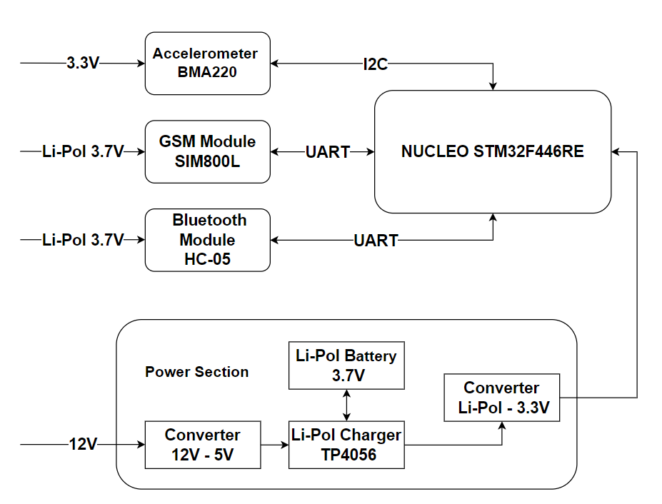

# Motorcycle Alarm

The repository contains the source code of the motorcycle alarm. The device works by detecting potential theft attempts and informing the owner of the vehicle about their occurrence. An additional feature of the alarm is the possibility of its remote activation and deactivation.

The project was implemented using the NUCLEO STM32F446RE development board. The software is based on the Zephyr real-time operating system.

Detection of potential theft attempts was realized by using the three-axis BMA220 accelerometer. The sensor configuration is performed using the I2C communication interface, while the information about motion detection is carried out through a dedicated external interrupt signal output.

In order to send alarm messages to the user, the SIM800L module operating in the GSM standard was used. The USART communication interface, through which AT commands are sent, was used to configure and control the module. After detecting a potential attempted theft, the device makes a phone call to the indicated number.

The activation and deactivation of the alarm takes place with the use of the Bluetooth HC-05 module. Changing the alarm status is done by sending an appropriate string of characters to the device, which will enable or disable the accelerometer interrupt service.

The device is powered by a voltage with a nominal value of 12V, which comes from the motorcycle's electrical system. To ensure the alarm operation when the vehicle battery is discharged, the project uses an additional power source in the form of a Li-Pol battery with a nominal voltage of 3.7 V. 